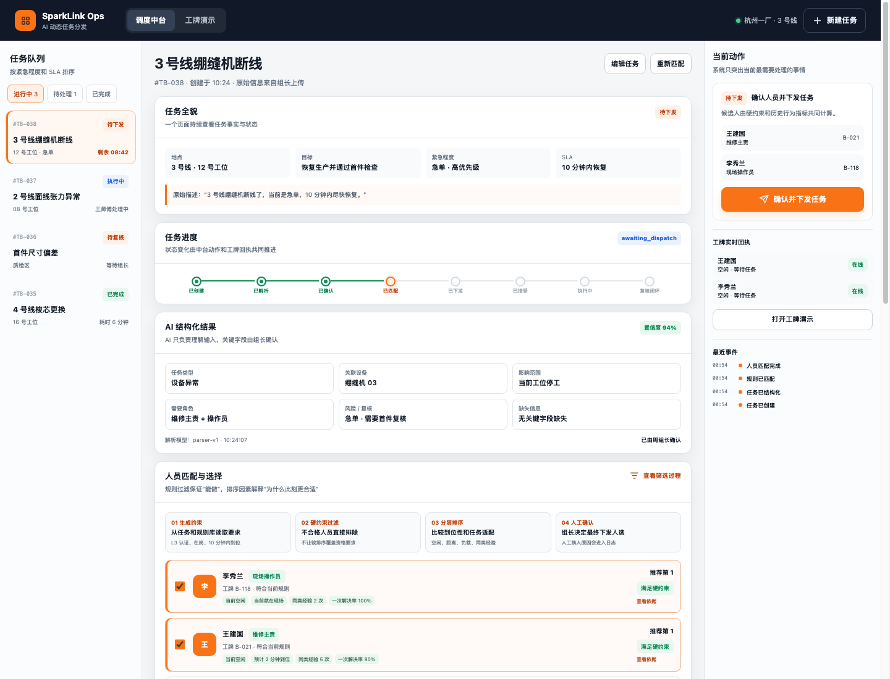
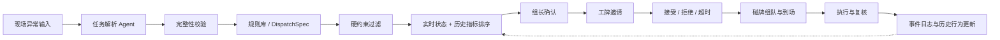

# SparkLink · AI-native 动态任务分发

> 让任务交给“当下真正适合的人”，而不是永远交给“最强的人”。

SparkLink 是一个面向现场组织的 AI-native 动态任务分发系统。它把任务理解、组织规则、人员能力、实时状态和历史行为放在同一条可审计的协作链路里，让组织可以在突发异常和非标准任务中，更灵活地完成分工、协作与复盘。

当前 MVP 聚焦于鞋服工厂的非标快反缝制线路，并配合智能工牌模拟：当设备异常发生时，系统识别任务，按照硬约束筛出“能做的人”，再结合此刻的可用状态、到位时间和历史表现排序，由组长确认后发送到工牌，推动临时小队形成并完成闭环。

## 核心理念

传统系统通常按照固定岗位、静态班表或单一绩效分数派工。但现场任务往往是动态的：同一个人可能正在处理更高优先级任务、距离现场较远、暂时不能被打断，或者虽然具备资格，却在这一类设备上返工率较高。

SparkLink 将“适合”拆成可以解释和复核的事实：

- **知识库回答应该怎么派**：资格、认证、角色、权限、SLA、升级和复核规则；
- **状态库回答现在是什么情况**：在岗、位置、当前任务、负载、可打断状态和邀请回执；
- **历史库回答过去发生过什么**：同类任务经验、一次解决率、返工率、SLA 达成率、复核结果和人工换人原因。

系统坚持先硬约束、后软排序：没有必要认证的人不会因为历史分数高而被派为主责；在合格候选人中，历史行为数据只用于解释“为什么此刻更适合”。

## 当前演示



演示场景：3 号线绷缝机断线，急单，目标是在 10 分钟内恢复生产并通过首件检查。调度台会展示任务解析、规则展开、候选人资格与历史指标、组长确认和事件时间线。

- [交互式 HTML Demo](toB/第一版技术方案_Demo.html)
- [ToB Agent 后端说明](toB/agent-backend/README.md)

## 系统如何运行



一次任务的最小闭环是：

```text
创建任务
→ AI/Mock 结构化
→ 规则匹配
→ 候选筛选与排序
→ 组长确认并下发
→ 员工接受/拒绝
→ 碰牌组队
→ 设备 NFC 到场
→ 提交完成
→ 组长复核
→ 写入历史行为数据
```

模型只负责理解、追问、解释和总结；权限、资格、状态、幂等、状态机、超时和审计由确定性代码负责。模型不可用时，仍可以使用 Mock 解析和人工方式完成派工。

## 当前实现

`toB/agent-backend/` 是一个不依赖额外 npm 包的本地 MVP：

- Node.js 24 + 原生 `node:sqlite`；
- SQLite 保存人员、技能认证、实时状态、任务、邀请、临时小队、历史结果和事件日志；
- JSON 规则库与 Mock 工厂数据开箱即用；
- 根据历史任务事实计算一次解决率、返工率、SLA 达成率、平均处理时长和样本量；
- API 支持创建、解析、派发、接受/拒绝、组队、到场、完成、复核、重新匹配和数据导入；
- 可选接入 DeepSeek，但真实 API key 只通过环境变量提供，不进入代码或仓库。

核心数据文件：

```text
toB/agent-backend/data/
├── people.json              # 人员身份与组织
├── capabilities.json        # 技能、等级、认证与角色
├── availability.json        # 当前在岗、位置和负载状态
├── historical_tasks.json    # 历史任务行为样本
└── rules.json               # 规则库
```

## 本地运行

需要 Node.js 22 或更高版本。

```bash
cd toB/agent-backend
DISPATCH_MODEL_MODE=mock npm start
```

浏览器打开 <http://127.0.0.1:8787/>。

Mock 模式不需要任何模型 API 或云数据库。首次启动会自动创建 SQLite 文件，并把 `data/` 下的演示数据写入数据库；别人 clone 本仓库后可以直接复现同一套演示。

如果要启用 DeepSeek 任务解析：

```bash
DEEPSEEK_API_KEY="你的 key" \
DEEPSEEK_MODEL=deepseek-chat \
npm start
```

## 后续方向

当前版本用于验证“理解任务 → 动态组队 → 完成闭环”这一条最小链路。下一步可以继续接入：

- CSV/JSON 批量导入真实人员、认证和历史任务；
- 候选人拒绝后的自动补位、邀请超时和升级策略；
- 真实工牌、NFC、消息和考勤系统；
- PostgreSQL / Supabase 等具备持久化能力的生产数据库；
- 多工厂、多车间和跨组织协作；
- 在人工审核前提下，从事件日志提取可复用的任务记忆。

## 设计边界

- AI 推断不能未经人工确认变成硬约束；
- 不使用情绪、性格、私人关系等敏感信息进行派工；
- 不自动修改技能认证、组织权限或核心派工规则；
- 关键状态变化必须可审计、可重放、可人工接管；
- 历史指标必须展示样本数和时间范围，避免小样本被误读。
